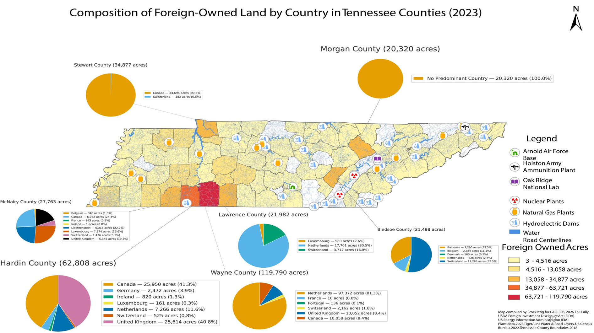

# Foreign-Owned Land and Critical Infrastructure in Tennessee

## Overview
This project examines the spatial relationship between foreign-owned agricultural
land in Tennessee and major national-security and critical infrastructure sites.

Using county-level data reported under the Agricultural Foreign Investment Disclosure
Act (AFIDA) and multiple infrastructure datasets, the analysis highlights geographic
patterns of land ownership, infrastructure proximity, and regional concentration.
The goal is to support spatial understanding rather than draw policy conclusions.

## Research Questions
- Where is foreign-owned agricultural land concentrated across Tennessee?
- How does this land spatially relate to critical energy, defense, and infrastructure sites?
- Are any regional proximity patterns observable at the county level?

## Methodology
- Compiled foreign-owned agricultural land data from USDA AFIDA reports
- Aggregated ownership totals at the county level
- Created geospatial datasets representing critical energy and defense infrastructure
- Joined tabular ownership data to Tennessee county polygons
- Produced choropleth and overlay maps to visualize spatial relationships

## Preview

### Project Overview

### Spatial Analysis & Results

## Full Project Presentation
 **[Download the full presentation PDF](Foreign_Owned_Land_and_Critical_Infrastructre_Tennessee_Ittig.pdf)**

## Key Skills Demonstrated
- Spatial data integration and attribute joins
- Choropleth mapping and classification
- Infrastructure and national-security GIS analysis
- Spatial pattern interpretation
- Cartographic communication and presentation design

## Tools Used
- ArcGIS Pro
- Adobe Illustrator (final cartographic layout, legends, and figure refinement)
- USDA AFIDA (Agricultural Foreign Investment Disclosure Act) data
- U.S. Energy Information Administration (EIA) infrastructure datasets

## Notes & Limitations
- AFIDA data represents agricultural land only and is reported at the county level
- Parcel-level foreign ownership data is not publicly available
- Infrastructure locations are generalized and appropriate for academic analysis

